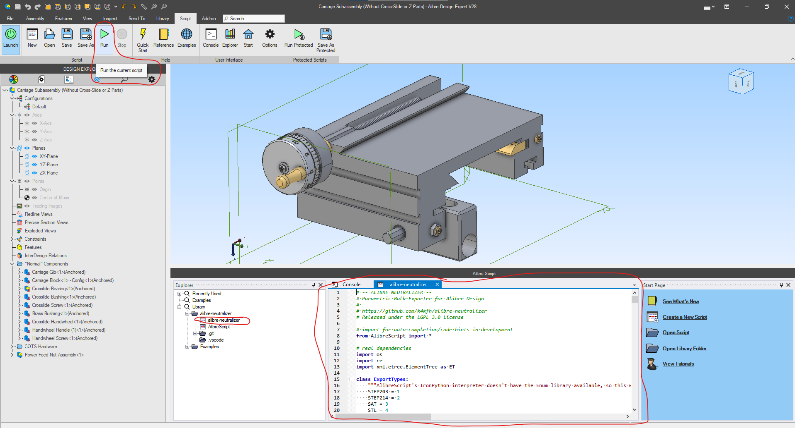
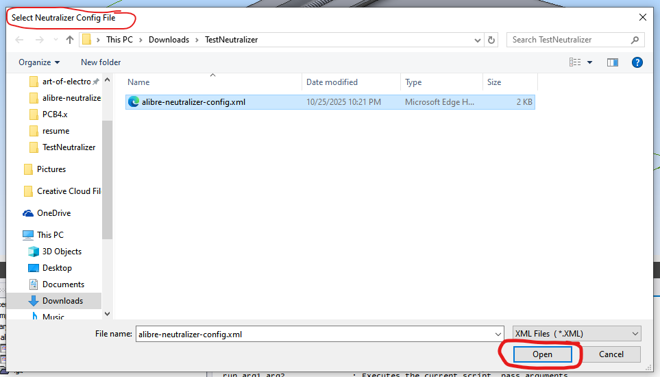
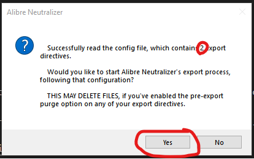
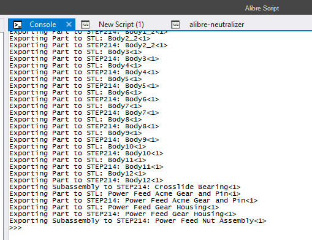
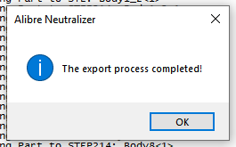

# Alibre Neutralizer

Alibre Neutralizer is a configurable, repeatable bulk-exporter for Alibre Design. It walks a top-level assembly and recursively exports every subassembly and part to neutral exchange formats, driven by an XML configuration file so the same export can be reproduced consistently (for example, as part of a Git-versioned hardware project).

## Features

- Recursively exports a complete assembly, with all of its subassemblies and parts exported as individual files (each component is exported only once).
- Exports common neutral formats: STEP (AP203 and AP214), SAT, IGES, and STL.
- Exports component metadata to CSV sidecar files: Alibre Properties (`CSV_Properties`) and Design Parameters / equations (`CSV_Parameters`). Parameters are alphabetized so the output is stable across runs and produces consistent version-control diffs.
- Parametric file and folder naming using Alibre Properties (e.g. `{Number}`, `{Name}`, `{Supplier}`, `{Revision}`) so exports can be grouped and named automatically.
- Multiple "Export Directives" run in a single pass, each with its own format, path scheme, and rules for whether the root assembly, subassemblies, and parts are included.
- Optional pre-export purge that clears only the matching file types from a target directory before writing fresh exports.

## Requirements

- Alibre Design. The C# add-on project references Alibre Design 29.0.0.29060 assemblies and targets x64.
- To run the script directly: Alibre Design with the Alibre Script add-on.
- To build the optional add-on: .NET Framework 4.8.1, IronPython 2.7.12, and Inno Setup (for the installer).

## Installation

There are two ways to use Alibre Neutralizer.

**As an Alibre Script:**
Download or clone the repository into a subfolder of the Alibre Script Library (by default under the Documents folder, e.g. `C:\Users\<user>\Documents\Alibre Script Library`). Only `source/alibre-neutralizer.py` is required; keeping the full repository also provides the example configuration file.

**As a compiled add-on:**
The `source/alibre-neutralizer-addon/` folder contains a C# add-on (`.adc` manifest plus IronPython host) that registers an "Alibre Neutralizer" ribbon menu and runs the bundled script. Build `source/alibre-neutralizer-addon/alibre-neutralizer-addon.sln`, then run the Inno Setup script (`alibre-neutralizer-addon.iss`) to produce an installer that copies the add-on into the Alibre `Addons` directory and registers it under the `Alibre Design Add-Ons` registry key.

## Usage

1. Create an XML configuration file describing your Export Directives. Each directive sets a `type` (`STEP203`, `STEP214`, `SAT`, `STL`, `IGES`, `CSV_Properties`, or `CSV_Parameters`), a `RelativeExportPath` (with optional `{Property}` placeholders), an optional `PurgeDirectoryBeforeExporting` path, and the `EnableRootAssemblyExport` / `EnableSubassemblyExport` / `EnablePartExport` flags. See `source/example-alibre-neutralizer-config.xml` for a working template.
2. Open the top-level assembly you want to export in Alibre Design.
3. Run the tool: in the Alibre Script add-on, open `source/alibre-neutralizer.py` and click Run; or, if the add-on is installed, select "Run Alibre Neutralizer" from the Alibre Neutralizer ribbon menu.
4. Select your configuration file when prompted, review the summary dialog (which reports how many export directives were parsed), and confirm to start the export.
5. Progress and any errors are logged to the Alibre Script console; a notification appears when the export completes.

Note: paths are resolved relative to the configuration file's location (offset by the optional `BaseExportPath`). Exporting directly from Alibre PDM is not supported reliably; export a package and run against that instead.

## Screenshots

Run the script from the Alibre Script ribbon:

Select your configuration file:

Confirm the export:

Progress is logged to the Alibre Script console:

Completion notification:

## License

GNU Lesser General Public License v3.0. See [LICENSE](../LICENSE.md).
